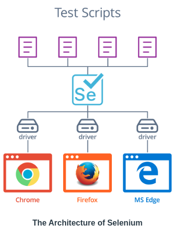
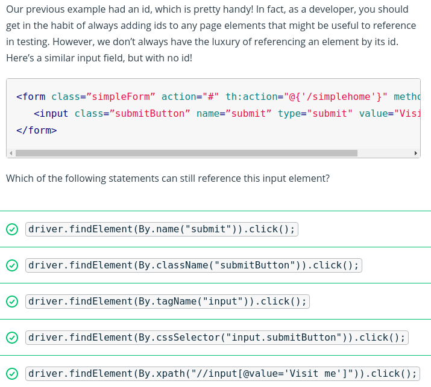

# Testing
-   **Testing with JUnit**: We introduce JUnit, the standard testing and assertion framework for Java. We learn how to write new tests and check out assumptions by using JUnit's extensive library of assertion methods.
-   **JUnit in Situ**: We look at how we can use IntelliJ (or any other IDE) to run tests, debug errors, and get reports about code coverage.
-   **Selenium/WebDriver**: We introduce Selenium, a tool for browser automation, through its Java API,  `selenium-java`. We look at how to write Selenium scripts to simulate user actions in a browser at a high level.
-   **JUnit and Selenium**: We discuss how to use Selenium's java API inside of JUnit tests, which opens the door to an advanced technique: automated user testing.

## Testing - Why and How ?


The figure above shows the test-driven development lifecycle. First, there is an idea for a new feature. That feature idea is turned into a series of user stories, which are then turned into tests, which fail because the feature does not exist yet. The developers then work on the feature's code requirements until all of the tests pass, and the cycle begins anew.

In this model, the "red then green" philosophy is dominant - tests should be written _before_ the feature to be tested, meaning that they start off failing - aka, the tests are "red." Then, as the feature is implemented, one test after another should start to pass - aka, become "green."

To facilitate this approach, it's useful to have a standard way to describe features or requirements to be tested. For this, the concept of a "**user story**" is used. A user story describes the functionality a feature should have from the perspective of a user interacting with the application. Typically, the format of a user story is:

**As a user, I can  _take some action_  in order to  _achieve some goal_**.

Often a feature will be broken up into many user stories, each of which should correspond to at least one test to be implemented for that feature. If all the tests pass, it means that all of the user stories are successfully implemented, and the feature is complete.


## Unit Test [vs] Integration Test


**Unit tests** are meant to test a single unit or component of an application or process - these tests should be simple, and verify that a specific method, component, or process step acts as expected according to its inputs.

**Integration tests** are the next layer up from unit tests. Instead of testing a single unit of an application, they test multiple units and how they _integrate_ with one another. Often, an integration test will validate an entire user story, while a unit test will validate a single step in the process a user story describes.

The rule of thumb is that **unit tests** should be **used to test** invariants - **conditions that do not change** - and **integration tests** should be **used to test user actions and entire process flows** .

### Key Terms
-   **Unit Tests**: A unit test only validates the smallest unit of a computational process. That might mean a test of a single method, or a single component in an application.
-   **Invariants**: An invariant is a law of computation, something that shouldn't change despite changing circumstances. For example, adding 0 to a number should always result in the original number, and dividing by 0 should always result in an error.
-   **Integration Tests**: Integration tests are intended to validate the operation of multiple application components as they interact with each other - or  _integrate_  with one another.

## Testing with JUnit
Unit is the standard Java testing framework, and despite its name. JUnit expects all tests for an application to be collected in class files, just like any other Java code.


### Annotations
JUnit provides an annotation,  `@Test`, that can be placed on a method in a test class to declare a single test. Each method annotated like this can be either executed individually, or in a group - and in both cases, JUnit will generate a report that lists each test that was run, and whether it was successful or not.

In order for JUnit to know if a test is successful or not we need to use 
**assertions**. `@Test`-annotated methods should not have a return value.

JUnit provides a few extra annotations to define this initialization code.  `@BeforeEach`- and  `@AfterEach`-annotated methods will be called before an after each  `@Test`-annotated method, respectively, and  `@BeforeAll`- and  `@AfterAll`-annotated methods will be called at the before and after  _all_  tests have been executed, respectively.

### Assertions
An assertion, in the context of JUnit, is a method that can be called to **check the *assumptions about the behavior* of the unit under test**. If the assumptions are correct, the assertion silently returns and the test method continues. If they're false, the assertion throws a special exception class that JUnit uses to build the final failure report, and the test method halts execution.

> Assertions are the static methods defined in the Assertion class. See the list of assertions  [here](https://junit.org/junit5/docs/current/api/org.junit.jupiter.api/org/junit/jupiter/api/Assertions.html)  , and an example on how to use assertions in a unit test  [here](https://junit.org/junit5/docs/current/user-guide/#writing-tests-assertions).

## Selenium/Webdriver


The figure above shows the architecture of selenium. Test scripts written using Selenium's Java API are translated by Selenium to work on different browsers using different drivers.

### Example - Selenium in Action 
```java
public static void main(String[] args) throws InterruptedException {
        WebDriverManager.chromedriver().setup();
        WebDriver driver = new ChromeDriver();
        driver.get("http://www.google.com");
                                // It determines how the driver for an element in the page
        WebElement inputField = driver.findElement(By.name("q")); 
        inputField.sendKeys("selenium");
        inputField.submit();
        List<WebElement> results = driver.findElements(By.cssSelector("div.g a"));
        for (WebElement element : results) {
            String link = element.getAttribute("href");
            System.out.println(link);
        }
        Thread.sleep(5000);
        driver.quit();
    }
```

Every Selenium script has to start by initializing a web driver. In order to download automatically the web driver to be used, An extra lib must be imported, this lib is called WebDriverManager and it download the binary file for Selenium's driver for Google Chrome (or other browsers).

Once the driver is downloaded, it expect to be told which web page to visit. This is done with `driver.get("http://www.google.com");` for example;

In order to interact with or extract data from the web page the required HTML elements on the page must be selected. In the example above, `driver.findElement(By.name("q"));`  was defined to select the google search input element.

In order to interact with the elements selected, There are several methods that can be called on them. In the example case, the `inputField.sendKeys("selenium");` was used to simulate typing the word `selenium` into google, and the `inputField.submit();` was used to simulate submitting the search form.

Once that the page iteraction happend, an action to read the elements was done by using `driver.findElements()` to get a list of matching elements, instead of a single one.

> The final part of every Selenium script is shutting down the driver. Since the driver is an external program, if we don't call `driver.quit()`, the automated browser window will never close on its own.

### Key Terms
-   **Web Driver**: In order for Selenium to assume control of a browser, it needs a program to interface with the specific browser's API. This program is called a web driver, and there are different web drivers for each major browser.


- If you want to reference an attribute not specifically supported, you can still find it through xpath.

### Further Research
-   [WebDriverManager on Github, with Documentation on Its Use and Motivation](https://github.com/bonigarcia/webdrivermanager)
-   [Official Selenium Documentation on Finding Elements on a Web Page, with Code Examples](https://www.selenium.dev/documentation/en/getting_started_with_webdriver/locating_elements/)
-   [DOM: Overview and the fundamental data types](https://developer.mozilla.org/en-US/docs/Web/API/Document_Object_Model/Introduction)

### Page Load Time
On the web, page load times can vary wildly according to different internet providers, the size of the resources a page has to load, the speed at which the server handles requests, and so on. It's virtually impossible to predict exactly when a page will load, and this presents a problem for testing. If Selenium were asked to find an element on a page before the page finishes loading, it would throws an exception.

In order to avoid selenium looking for elements in a page that still loding it is possible to use `WebDriverWait`.
```java
WebDriverWait wait = new WebDriverWait(driver, 10);
WebElement marker = wait.until(webDriver -> webDriver.findElement(By.id("page-load-marker")));
```

