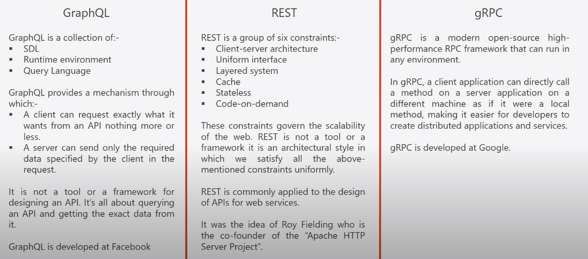
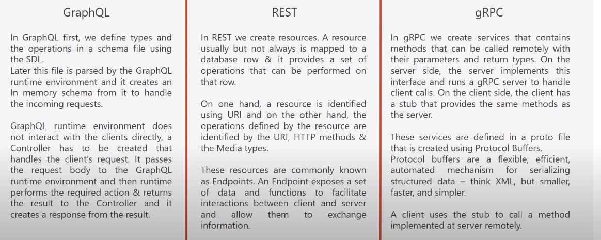
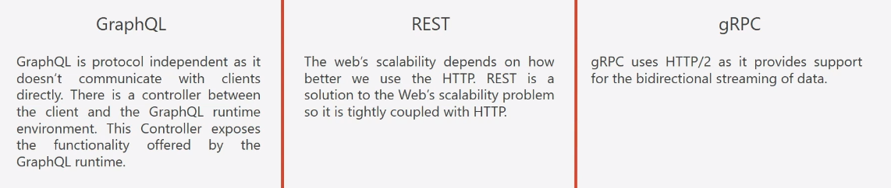
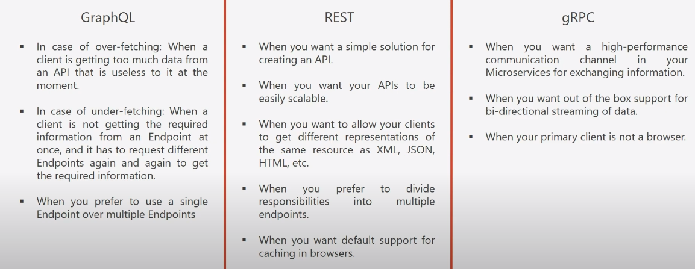

# GraphQL
[GraphQL](https://graphql.org/)  is a query language for APIs or a syntax that describes how to ask for data and is generally used to load data from a server to a client. GraphQL offers maximum efficiency and flexibility because it allows the calling client to specify exactly what data it needs.

## Why GraphQL?
The  [Representational State Transfer](https://en.wikipedia.org/wiki/Representational_state_transfer)  (REST) architecture is the most popular way to expose data from a server through an  [API](https://en.wikipedia.org/wiki/Application_programming_interface).

REST defines a set of principles that must be followed. There's a certain degree of freedom, but the clients have to be adapted to the way in which the resources are represented on the server side, which makes REST not a good fit for some cases.

[GraphQL](http://graphql.org/)  is a query language that offers an alternative model to developing APIs using a strong type system to provide a detailed description of an API.

## What is GraphQL?
**GraphQL is a collection of three things:**
- **Schema definiton language or SDL**
	- SDL is used to define a GraphQL schema
	- A GraphQL schema is used to expose the functionalities that are available in an application to its users (adding and get operations)
	- A GraphQL schema contains: Types which are similar to classes in java, and Operations which can be performed on these types. Similar to methods in java
- **Runtime evironment**
	- Runtime environment performs to major operations: 1. Parsing the GraphQL schema file and creating an 'In memory schema' from it. 2. Executing the operations specified in the client's request
- **Query language**
	- Used by clients to use operations defined in the GraphQL schema

GraphQL describes the data offered by an API through a schema that contains:

-   Data types and relationships between them
-   A set of operations:    
    -   Queries to get data    
    -   Mutations to create, update, and delete data

```
type Song {
   id: ID!
   title: String!
   duration: Int!
   genre: String!
   artist: Artist!
}

type Artist {
   id: ID!
   name: String!
   country: String!
   songs: [Song]
}
```

Notice that the fields are typed. These types can be scalar types (`Int`,  `Float`,  `String`,  `Boolean`  and  `ID`) or references to other types defined in the specification.

It is possible specify if they are required (`!`) or if they are an array (`[]`). 

```
type SongQueries {
   allSongs: [Song]
   filterSongsByGenre(genre: String!): [Song]
}

type SongMutations {
   newSong(song: SongInput!): Song
}

schema {
   query: SongQueries
    mutation: SongMutations
}
```

### GraphQL vs REST vs gRPC.

#### Definition


#### How it works?


#### Protocol


#### When to use what?


### Configuring GraphQL in the Project
To include GraphQL in your project, a couple of dependencies are needed:

-   **graphql-spring-boot-starter** - This starter is very helpful because it will add and automatically configure a GraphQL Servlet that you can access at /graphql . This starter will also use a GraphQL schema library to parse all schema files found on the classpath. The starter will also set up an endpoint that can access POST requests.
-   **graphql-java-tools**  - A helper library to parse the GraphQL schema.

#### GraphiQL and GraphQL Properties
```
graphql.servlet.mapping=/graphql
graphql.servlet.enabled=true
graphql.servlet.corsEnabled=true

graphiql.enabled=true
graphiql.endpoint=/graphql
graphiql.mapping=graphiql
```

### GraphQL Schema
The **GraphQL schema** defines the data points offered via an API. The schema contains the **data types and relationships** between them and the **set of operations available**, things like `queries` for retrieving data and `mutations` for creating, updating, and deleting data.

```json
type Location {
 id: ID!
 name: String!
 address: String!
}

type Query {
 findAllLocations: [Location]!
}

type Mutation {
 newLocation(name: String!, address: String) : Location!
 deleteLocation(id:ID!) : Boolean
 updateLocationName(newName: String!, id:ID!) : Location!
}
```

PS: GraphQL schema (`.graphqls`) files found on the classpath are processed and the necessary beans are wired.

GraphQL offers operations on data like queries and mutations.

### GraphQL - Queries
A query allows for the retrieving of data. Each query will have a specific object that it returns and based on the object returned, you can add or remove fields to match the exact data you need to fit your specific use case.

### GraphQL - Mutations
GraphQL has the ability to update the data stored on the server, by means of mutations. Mutations, such as, create, update, or delete will change the data, unlike a query.

### GraphQL - Types


### GraphiQL
The tool called GraphiQL is a **simple web app** that is able to **communicate with any GraphQL Server** and **execute queries** and **mutations** against it.


`graphql-java`  supports the following types:

-   Scalar:
    -   String    
    -   Boolean    
    -   Int    
    -   Float    
    -   ID    
    -   Long    
    -   Short    
    -   Byte    
    -   Float    
    -   BigDecimal    
    -   BigInteger
    
-   Object (like the  `Book`  or  `Author`  types defined above)
-   Interface, for example:
	```
	interface Shape {
	  color: String!,
	  size: Int!
	}
	type Triangle implements Shape { }
	type Square implements Shape { }
	type Query {
	  searchByColor(color: String!): [Shape]!
	}
	```
- Union
	```
	type Triangle {
	  # fields ...
	}
	type Square {
	  # fields ...
	}
	union Shape = Triangle | Square
	type Query {
	  searchByColor(sizes: Int!): [Shape]!
	}
	``` 
- InputObject
	```
	input BookInput {
	  title: String!
	  genre: String!
	  duration: Int!
	  artistID: ID!
	}
	```
- Enum 
	```
	enum Shape {
	  TRIANGLE
	  SQUARE
	}
	```

### The `GraphQL*Resolvers` 
For scalar fields, getter and setter methods will be enough. However, for fields with complex types (like  objects), it is necessary  to use  `Resolver`  objects to  _resolve_  the value of those fields.

`Resolver`  objects implement the interface  `GraphQLResolver`.

GraphQL Java Tools works with four types of  `Resolver`  classes:

-   `GraphQLResolver<T>`  to resolve complex types.
-   `GraphQLQueryResolver`  to define the operations of the root  `Query`  type.
-   `GraphQLMutationResolver`  to define the operations of the root  `Mutation`  type.
-   `GraphQLSubscriptionResolver`  to define the operations of the root  `Subscription`  type.

```java
public class BookResolver implements GraphQLResolver<Book> {
    private AuthorRepository authorRepository;

    public BookResolver(AuthorRepository authorRepository) {
        this.authorRepository = authorRepository;
    }

    public Author getAuthor(Book book) {
        return authorRepository.findOne(book.getAuthor().getId());
    }
}
```

```java
public class Query implements GraphQLQueryResolver {
    private BookRepository bookRepository;
    private AuthorRepository authorRepository;

    public Query(AuthorRepository authorRepository, BookRepository bookRepository) {
        this.authorRepository = authorRepository;
        this.bookRepository = bookRepository;
    }

    public Iterable<Book> findAllBooks() {
        return bookRepository.findAll();
    }

    public Iterable<Author> findAllAuthors() {
        return authorRepository.findAll();
    }

    public long countBooks() {
        return bookRepository.count();
    }
    public long countAuthors() {
        return authorRepository.count();
    }
}
```

```java
public class Mutation implements GraphQLMutationResolver {
    // ...

    public Book updateBookPageCount(Integer pageCount, Long id) {
        Book book = bookRepository.findOne(id);
        if(book == null) {
            throw new BookNotFoundException("The book to be updated was not found", id);
        }
        book.setPageCount(pageCount);

        bookRepository.save(book);

        return book;
    }
}
```

#### Declare Spring Beans The Resolvers
```java
@Bean
	public BookResolver authorResolver(AuthorRepository authorRepository) {
		return new BookResolver(authorRepository);
	}

	@Bean
	public Query query(AuthorRepository authorRepository, BookRepository bookRepository) {
		return new Query(authorRepository, bookRepository);
	}

	@Bean
	public Mutation mutation(AuthorRepository authorRepository, BookRepository bookRepository) {
		return new Mutation(authorRepository, bookRepository);
	}
```


### GraphQL Error Handling - `GraphQLError`
By default, any unhandled exception on the server-side will reach the client as a generic _Internal server error_.

Only the client errors (for example, when you misspell the name of a field) are processed. The rest of the errors are treated as a generic error and then logged.

```java
public class BookNotFoundException extends RuntimeException implements GraphQLError {

    private Map<String, Object> extensions = new HashMap<>();

    public BookNotFoundException(String message, Long invalidBookId) {
        super(message);
        extensions.put("invalidBookId", invalidBookId);
    }

    @Override
    public List<SourceLocation> getLocations() {
        return null;
    }

    @Override
    public Map<String, Object> getExtensions() {
        return extensions;
    }

    @Override
    public ErrorType getErrorType() {
        return ErrorType.DataFetchingException;
    }
}
```
`GraphQLError` provides a field called _extensions_ to pass additional data to the error object send to the client. In this case, we'll use it to pass the invalid book ID.

#### Customizing Returned Exception Message
By using an exception as a GraphQLError, the client will receive the complete stack trace in addition to the exception message.

If this behavior is not wanted, it is possible to create an adapter class to _hide_ the exception

```java
public class GraphQLErrorAdapter implements GraphQLError {

    private GraphQLError error;

    public GraphQLErrorAdapter(GraphQLError error) {
        this.error = error;
    }

    @Override
    public Map<String, Object> getExtensions() {
        return error.getExtensions();
    }

    @Override
    public List<SourceLocation> getLocations() {
        return error.getLocations();
    }

    @Override
    public ErrorType getErrorType() {
        return error.getErrorType();
    }

    @Override
    public List<Object> getPath() {
        return error.getPath();
    }

    @Override
    public Map<String, Object> toSpecification() {
        return error.toSpecification();
    }

    @Override
    public String getMessage() {
        return (error instanceof ExceptionWhileDataFetching) ? ((ExceptionWhileDataFetching) error).getException().getMessage() : error.getMessage();
    }
}
```

Now, create bean of type `GraphQLErrorHandler` to replace the default error handler implementation:

```java
@Bean
	public GraphQLErrorHandler errorHandler() {
		return new GraphQLErrorHandler() {
			@Override
			public List<GraphQLError> processErrors(List<GraphQLError> errors) {
				List<GraphQLError> clientErrors = errors.stream()
						.filter(this::isClientError)
						.collect(Collectors.toList());

				List<GraphQLError> serverErrors = errors.stream()
						.filter(e -> !isClientError(e))
						.map(GraphQLErrorAdapter::new)
						.collect(Collectors.toList());

				List<GraphQLError> e = new ArrayList<>();
				e.addAll(clientErrors);
				e.addAll(serverErrors);
				return e;
			}

			protected boolean isClientError(GraphQLError error) {
				return !(error instanceof ExceptionWhileDataFetching || error instanceof Throwable);
			}
		};
	}
```

To show the exception stack trace to the clients,  just return the list of errors that the method `processErrors` receives as an argument.

To not show the exception stack, do as the code snippet above:
	First collect the client errors as they are, then the server errors, converting them to the adapter type (GraphQLErrorAdapter), and finally returning a list of all the errors collected.