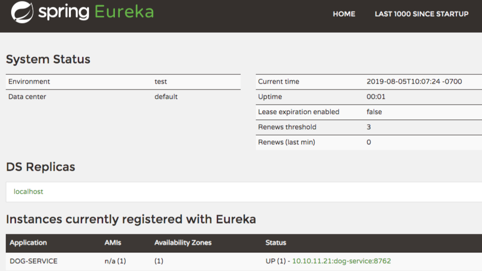

# Spring Cloud and Eureka
Eureka, created by Netflix, is responsible for the registration and discovery microservices. Spring has incorporated Eureka into [Spring Cloud](https://spring.io/projects/spring-cloud).

Eureka consists of a server and a client-side component. The **server component** will be the registry in which all the **microservices register** their availability. **The microservices use the Eureka client to register**; once the registration is complete, it notifies the server (eureka service component) of its existence.


## Spring Eureka Server Component Configuration

### Setting `application.property`
```
spring.application.name=eureka-server
server.port=8761

# avoid registering itself as a client
eureka.client.register-with-eureka=false
eureka.client.fetch-registry=false
logging.level.com.netflix.eureka=ON
logging.level.com.netflix.discovery=ON
```

### Enabling Eureka Server on Spring
```java
import org.springframework.boot.SpringApplication;
import org.springframework.boot.autoconfigure.SpringBootApplication;
import org.springframework.cloud.netflix.eureka.server.EnableEurekaServer;

@SpringBootApplication
@EnableEurekaServer
public class EurekaApplication {

    public static void main(String[] args) {
        SpringApplication.run(EurekaApplication.class, args);
    }

}
```

### Eureka Console
Navigate to [http://localhost:8761/](http://localhost:8761/) to view the Eureka web console.

## Spring Eureka Client Component Configuration
For a @SpringBootApplication to be discovery-aware, all that's needed is the Spring Discovery Client (i.e., `spring-cloud-starter-netflix-eureka-client` dependency) in the classpath. The next step is to annotate the main Spring application class with the @EnableEurekaClient annotation. @EnableEurekaClient is optional if the `spring-cloud-starter-netflix-eureka-client` dependency is on the classpath.

### Import Dependecies
```
<dependency>
            <groupId>org.springframework.cloud</groupId>
            <artifactId>spring-cloud-starter-netflix-eureka-client</artifactId>
        </dependency>
        <dependency>
            <groupId>org.springframework.cloud</groupId>
            <artifactId>spring-cloud-starter-config</artifactId>
        </dependency>
```
### Enabling Eureka Client on Spring
```java
import org.springframework.boot.SpringApplication;
import org.springframework.boot.autoconfigure.SpringBootApplication;
import org.springframework.cloud.client.discovery.EnableDiscoveryClient;
import org.springframework.cloud.netflix.eureka.EnableEurekaClient;

@SpringBootApplication
@EnableEurekaClient
public class DogMicroserviceApplication {

    public static void main(String[] args) {
        SpringApplication.run(DogMicroserviceApplication.class, args);
    }

}
```

### Setting `application.property`
```
spring.application.name=dog-service
server.port=8762
eureka.client.serviceUrl.defaultZone=http://localhost:8761/eureka/
eureka.client.service-url.default-zone=http://localhost:8761/eureka/
eureka.instance.prefer-ip-address=true
```

### Spring Eureka Client Registered 


## Spring Data REST
Spring Data REST builds on top of Spring Data repositories and automatically exports those as REST resources.

- Spring Data REST uses Jackson under the covers

### how does Spring Data Rest work?
1.  At application startup, Spring Data Rest finds all of the spring data repositories
2.  Then, Spring Data Rest creates an endpoint that matches the entity name
3.  Next, Spring Data Rest appends an S to the entity name in the endpoint
4.  Lastly, Spring Data Rest exposes CRUD (Create, Read, Update, and Delete) operations as RESTful APIs over HTTP


```
<!-- Spring Data REST -->  
<dependency>  
 <groupId>org.springframework.boot</groupId>  
 <artifactId>spring-boot-starter-data-rest</artifactId>  
</dependency>
```
 
**File `application.properties` Config**
```
# Where Spring DataREST will mount the APIs  
spring.data.rest.basePath=/api
```
### How does Spring DataREST Works?


When the Spring DataREST is configured in the project, it looks for any Spring Data Repository and create a hidden Spring MVC `RestController` for the repository. These generated `RestController` are responsible for exposing all of the rest endpoints.

### Spring DataREST Payload Return
The payload returned by Spring DataREST **contains 3 sections**:
```json
{
	"_embedded":{
		 "speakers": [
            {
                "firstName": "Sergio",
                "lastName": "Becker",
                "title": "Senior Developer",
                "company": "MicroOcean Software",
                "speakerBio": "Test",
                "speakerPhoto": null,
                "_links": {
                    "self": {
                        "href": "http://localhost:8080/api/speakers/1"
                    },
                    "speaker": {
                        "href": "http://localhost:8080/api/speakers/1"
                    },
                    "sessions": {
                        "href": "http://localhost:8080/api/speakers/1/sessions"
                    }
                }
            },............
         ]
	},
	"_links": {
		 "first": {
            "href": "http://localhost:8080/api/speakers?page=0&size=20"
        },
        "self": {
            "href": "http://localhost:8080/api/speakers"
        },
        "next": {
            "href": "http://localhost:8080/api/speakers?page=1&size=20"
        },
        "last": {
            "href": "http://localhost:8080/api/speakers?page=1&size=20"
        },
        "profile": {
            "href": "http://localhost:8080/api/profile/speakers"
        },
        "search": {
            "href": "http://localhost:8080/api/speakers/search"
        }
	},
	"page": {
		"size": 20,
        "totalElements": 40,
        "totalPages": 2,
        "number": 0
	}
}
```

- _links - This section are the hypermedia links that this resource knows about
- _embedded - This section is the collection (the data basically)
- page - This section encapsulates the paging information about the objects of this resource. 

### Spring DataREST - Search and Find Operations
**An Interface JpaRepository Defined in the Source Code**
```java
public interface SpeakerJpaRepository extends JpaRepository<Speaker, Long> {  
    List<Speaker> findByFirstNameAndLastName(String firstName, String lastName);  
  List<Speaker> findByFirstNameOrLastName(String firstName, String lastName);  
  List<Speaker> findBySpeakerPhotoNull();  
  List<Speaker> findByCompanyIn(List<String> companies);  
  List<Speaker> findByCompanyIgnoreCase(String company);  
  List<Speaker> findByLastNameOrderByFirstNameAsc(String lastName);  
  
  Speaker findFirstByFirstName(String firstName);  
}
```

**Payload for Calling: ** `http://localhost:8080/api/speakers/search`
```json
{
    "_links": {
        "findByLastNameOrderByFirstNameAsc": {
            "href": "http://localhost:8080/api/speakers/search/findByLastNameOrderByFirstNameAsc{?lastName}",
            "templated": true
        },
        "findByCompanyIn": {
            "href": "http://localhost:8080/api/speakers/search/findByCompanyIn{?companies}",
            "templated": true
        },
        "findBySpeakerPhotoNull": {
            "href": "http://localhost:8080/api/speakers/search/findBySpeakerPhotoNull"
        },
        "findByFirstNameAndLastName": {
            "href": "http://localhost:8080/api/speakers/search/findByFirstNameAndLastName{?firstName,lastName}",
            "templated": true
        },
        "findFirstByFirstName": {
            "href": "http://localhost:8080/api/speakers/search/findFirstByFirstName{?firstName}",
            "templated": true
        },
        "findByCompanyIgnoreCase": {
            "href": "http://localhost:8080/api/speakers/search/findByCompanyIgnoreCase{?company}",
            "templated": true
        },
        "findByFirstNameOrLastName": {
            "href": "http://localhost:8080/api/speakers/search/findByFirstNameOrLastName{?firstName,lastName}",
            "templated": true
        },
        "self": {
            "href": "http://localhost:8080/api/speakers/search"
        }
    }
}
```
**Why are the methods inherited through the JpaRepository interface not displayed in the payload?**
It is because Spring DataREST knows what methods are defined in this interface already because it is controlled by Spring Framework. So, this allow the framework to set up a standard REST service template URL pattern that maps the methods inherited from the interface.


### Change Resource Path and Customize some Payload Resources - `@RepositoryRestResource`
- `collectionResourceRel` attribute = Changes the collection attribute name inside the returned payload 
- `path` attribuite = 

```java
@RepositoryRestResource(path = "conference_sessions", collectionResourceRel = "conference_sessions")  
public interface SessionJpaRepository extends JpaRepository<Session, Long>, SessionCustomJpaRepository {  
    List<Session> findBySessionNameContains(String name);
```

**URL and Payload - Before ** `RepositoryRestResource`
- `http://localhost:8080/api/sessions/`  GET
```json
{
    "_embedded": {
        "sessions": [
            {
                "sessionName": "Keynote - The Golden Age of Software",
                "sessionDescription": "",
                "sessionLength": 45,
                "_links": {
                    "self": {
                        "href": "http://localhost:8080/api/sessions/1"
                    },
                    "session": {
                        "href": "http://localhost:8080/api/sessions/1"
                    },
                    "speakers": {
                        "href": "http://localhost:8080/api/sessions/1/speakers"
                    }
                }
            }, ...................
        ]
    }
```

**URL and Payload - After ** `RepositoryRestResource`
- `http://localhost:8080/api/conference_sessions/`  GET
```json
{
    "_embedded": {
        "conference_sessions": [
            {
                "sessionName": "Keynote - The Golden Age of Software",
                "sessionDescription": "",
                "sessionLength": 45,
                "_links": {
                    "self": {
                        "href": "http://localhost:8080/api/sessions/1"
                    },
                    "session": {
                        "href": "http://localhost:8080/api/sessions/1"
                    },
                    "speakers": {
                        "href": "http://localhost:8080/api/sessions/1/speakers"
                    }
                }
            }, ...................
        ]
    }
```

### Disabling Entity Exposure by REST Endpoint
```java
@RepositoryRestResource(exported = false)
```
