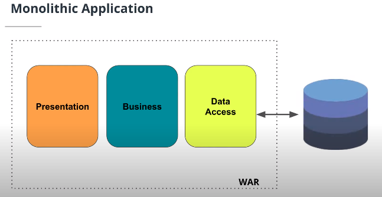
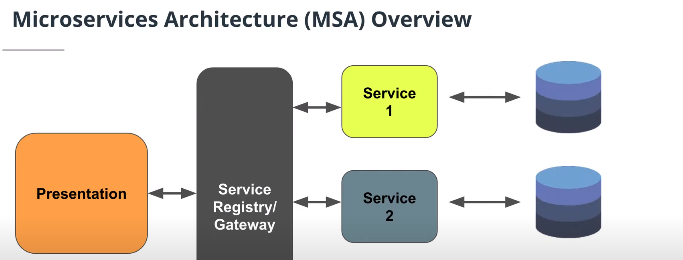

# Web Services, Microservices and REST 
## Web Services
A web service is a way to share data between two disparate systems. The communication typically happens between a client and a server.

-   Client - The client makes a request for data.
-   Server - The server responds to the client's request.

The means of communication between the client and server is via a standard web protocol like HTTP (or HTTPS) on the world wide web, that uses a common language like JSON or XML.

A client invokes a web service by sending an XML (or JSON) message, then waits for a corresponding XML response from the server.

### How Web Services Work

Step 1: The web service provider (the person who created the web service) defines a standard format for requests and also for the responses provided.

Step 2: The client sends a request to the web service across the network.

Step 3: The web service receives the request and performs an action (like query a database or perform a calculation) and sends a response back to the calling client.

## REST - Architecture Style
REST stands for **RE**presentational **S**tate **T**ransfer. It’s a set of guidelines application developers use to design APIs.

### REST 4 Principles
There are four principles that APIs follow:
1.  Data and functionality in the API are considered “resources” and identified through something called the URI, or Uniform Resource Identifier. These are accessed by web links.

2.  Resources are manipulated using a fixed set of operations. GET retrieves a resource. POST creates one. Use PUT to update the resource, and of course, DELETE will remove it.

3.  Resources can be represented in multiple formats, such as HTML, XML, plain text, and other formats defined by a media type.

4. Communication between the client and server (i.e. endpoint) is stateless. This means the server will not remember or store any state about the client that made the call.

## Microservices
### Monolithic Applications
N-Tier and monolithic applications used to be the de facto standard. In one single binary web artifact, like an  [EAR](https://en.wikipedia.org/wiki/EAR_(file_format))  or  [WAR](https://en.wikipedia.org/wiki/WAR_(file_format))  file, there would be a layered architecture with the decomposition of code into more functional components.

-   Presentation Layer
-   Business Process Layer/Service Layer
-   Data Access Layer

#### Disadvantages of Monolithic Architecture
There are several disadvantages to the n-tier monolithic application architecture:

-   Tight coupling of code which makes changes hard.
-   A single deployment with multiple layers that causes long testing, building, and deployment cycles.
-   A big monolithic application that makes code reuse and sharing of components difficult.

### Microservices Architecture - MSA
The Microservices Architecture (MSA) decomposes systems into discrete, individual, standalone components that can communicate amongst themselves, working together or with external systems.

MSA is a more agile framework that fits well with the cloud-based world and lends itself well to web application development and web service development.

#### Features
-   MSA is very flexible because it supports any language that can communicate via a RESTful endpoint and leverages REST over HTTP.
-   MSA offers agility and systems that are easier to write, test, deploy, and share.
-   MSA provides systems that can better scale to load and demand.
-   MSA provides systems that are resilient because failures are isolated and don’t cascade through the infrastructure.

