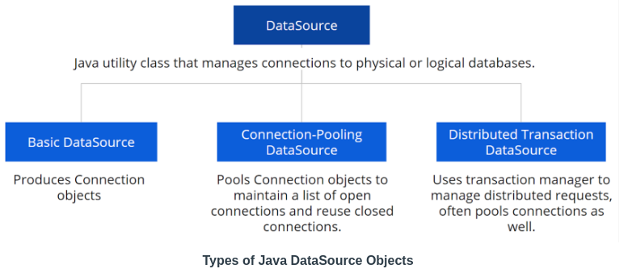

# Connecting to Data Sources

## Data Source vs. DataSource
**Data Source:** A source of data, such as a database. **DataSource:** Java utility class that manages connections to physical or logical databases.



PS: Spring uses the third variety for which the class platform **transction manager** acts as the intermediary between connection objects and Spring components.

## DataSources in Spring
### Spring DataSource Properties
Spring automatically builds a DataSource on startup. It can configure all the properties of the datasource by setting values in your application.properties file. Here is a  [List of Spring Data Properties](https://docs.spring.io/spring-boot/docs/current/reference/html/appendix-application-properties.html#data-properties). Anything beginning with spring.datasource refers to DataSource configuration.

Example application.properties:

```
# subprotocol // servername[:port] / databaseinstanceName:properties
spring.datasource.url=jdbc:mysql://localhost:3306/exampledb
spring.datasource.username=sa
spring.datasource.password=sa1234
```

Note that there is no property being specified on the URL string in the above example, because they are being
defined using additional rows in the property files;

Example spring.datasource.url with properties
```
spring.datasource.url=jdbc:mysql://localhost:3306/exampledb?serverTimezone=UTC
```

> What is the default behavior if no spring.datasource.url is provided?
> Answer: Create a DataSource for a in-memory database if one is found on the classpath

## Programmatic DataSource Configuration
### `@Bean`
The  `@Bean`  annotation marks methods that should create beans during Spring initialization. Each method will be executed and the returned object will be added as a Bean for Spring to use in dependency injection.

### Programmatic Configuration
DataSources can also be configured programmatically by creating a class annotated with `@Configuration` that returns a `@Bean` of the desired type. Spring will inject this DataSource whenever a DataSource is requested. This could be useful if there is the necessity to retrieve some DataSource properties dynamically.

```java
@Configuration
public class DatasourceConfig {

   @Bean
   public DataSource getDatasource() {
       DataSourceBuilder dsb = DataSourceBuilder.create();
       dsb.username("sa2");
       dsb.password(securePasswordService());
       dsb.url("jdbc:mysql://localhost:3306/exercise1");
       return dsb.build();
   }

   private String securePasswordService() {
       return "sa1234";
   }
}
```

### `@ConfigurationProperties`
Combine properties and programmatic configuration by using the  `@ConfigurationProperties`  annotation are able to be done. Spring will attempt to inject any properties found beginning with the provided prefix into the returned  `@Bean`.

**WARNING:** The values from `@ConfigurationProperties` are injected when the `@Bean` is returned, overwriting properties set programmatically

```java
@Configuration
public class DataSourceConfig {

   @Bean
   @Primary
   @ConfigurationProperties(prefix="aug.bueno.datasource")
   public DataSource getDataSource() {
       DataSourceBuilder dsb = DataSourceBuilder.create();
       dsb.url("jdbc:mysql://localhost:3306/plant");
       return dsb.build();
   }
}


// Properties
aug.bueno.datasource.username=sa
aug.bueno.datasource.password=sa1234

```

## Custom and Multiple Data Sources
### Custom DataSources
Different DataSource providers sometimes have different names for their properties. `DataSourceProperties` object can be used to manage converting between the standard `spring.datasource` properties and the desired DataSource type by creating a `@Bean` that returns a DataSourceProperties object populate from the properties file.

```java
@Bean
@Primary
@ConfigurationProperties("spring.datasource")
public DataSourceProperties getDataSourceProperties(){
   return new DataSourceProperties();
}
```

```java
@Bean
@Primary
@ConfigurationProperties(prefix = "spring.datasource.configuration")
public DataSource getDatasource(DataSourceProperties properties) {
   return properties.initializeDataSourceBuilder().type(HikariDataSource.class).build();
}
```

PS: `DataSourceProperties` is taking care of the `url`/`jdbcUrl` translation for you, you can configure it like this. The HikariDataSource spects `*.datasource.jdbcUrl=xyz` instead of `*.datasource.url=xyz`. The, we have these type of differences when configuring datasourcecs we can count on with `DataSourceProperties` to perform this "translation" to the right property.

### Multiple DataSources
If data is stored in multiple locations, Spring provides the feature to creating multiple DataSources Beans. In order to do that beans for an EntityManagerFactory and a TransactionManager must be provided.

To support Spring Data repositories use the `@EnableJpaRepositories` annotation to reference the specific classes.

**Example**

**Config I**
```java
@Configuration
@EnableJpaRepositories(basePackageClasses = Humanoid.class, entityManagerFactoryRef = "humanoidFactory")
public class DatasourceConfig {

   @Bean
   @Primary
   @ConfigurationProperties("spring.datasource")
   public DataSourceProperties getDataSourceProperties(){
       return new DataSourceProperties();
   }

   @Bean
   @Primary
   @ConfigurationProperties(prefix = "spring.datasource.configuration")
   public DataSource getDatasource(DataSourceProperties properties) {
       return properties.initializeDataSourceBuilder().type(HikariDataSource.class).build();
   }

   @Bean(name = "humanoidFactory")
   @Primary
   public LocalContainerEntityManagerFactoryBean humanoidEntityManagerFactory(
           EntityManagerFactoryBuilder entityManagerFactoryBuilder) {
       return entityManagerFactoryBuilder
               .dataSource(getDatasource(getDataSourceProperties()))
               .packages(Humanoid.class) // "com.foobar.foo.domain"
               .persistenceUnit("humanoid")
               .build();
   }

   @Bean(name = "humanoidTx")
   @Primary
   public PlatformTransactionManager humanoidTransactionManager(@Qualifier("humanoidFactory") EntityManagerFactory entityManagerFactory){
       return new JpaTransactionManager(entityManagerFactory);
   }

}
```

**Config II**
```java
@Configuration
@EnableJpaRepositories(basePackageClasses = {Outfit.class, OutfitRepository.class}, entityManagerFactoryRef = "outfitFactory")
public class Datasource2Config {

   @Bean
   @ConfigurationProperties("spring.datasource2")
   public DataSourceProperties getDataSource2Properties(){
       return new DataSourceProperties();
   }

   @Bean
   @ConfigurationProperties(prefix = "spring.datasource2.configuration")
   public DataSource getDatasource2(DataSourceProperties properties) {
       return properties.initializeDataSourceBuilder().type(HikariDataSource.class).build();
   }

   @Bean(name = "outfitFactory")
   public LocalContainerEntityManagerFactoryBean outfitEntityManagerFactory(
           EntityManagerFactoryBuilder entityManagerFactoryBuilder) {
       return entityManagerFactoryBuilder
               .dataSource(getDatasource2(getDataSource2Properties()))
               .packages(Outfit.class) //"com.foobar.bar.domain"
               .persistenceUnit("outfit")
               .build();
   }

   @Bean(name = "outfitTx")
   public PlatformTransactionManager outfitTransactionManager(@Qualifier("outfitFactory")EntityManagerFactory entityManagerFactory){
       return new JpaTransactionManager(entityManagerFactory);
   }

}
```
### Additional Resources
[Spring Boot documentation on custom and multiple DataSources](https://docs.spring.io/spring-boot/docs/current/reference/html/howto.html#howto-data-access)

## Initialization
### `spring.datasource.initialization-mode` values
**Embedded:**  Default. Initialization performed on embedded databases only.  
**Always:**  Initialization for both embedded and external databases.  
**Never:**  No initialization for either embedded or external databases.

### Initialization with Hibernate
#### `spring.jpa.hibernate.ddl-auto`
This property allows you to customize Hibernate’s initialization behavior.

**create**: Drop all tables for defined Entities, then create them.  
**create-drop**: Create tables, drop them when application stops.  
**update**: Attempt to migrate previous version of tables to match current Entities.  
**validate**: Throw an exception if tables or columns are missing.  
**none**: Do not initialize tables.

#### `show-sql`
Spring offers a useful command to print all generated sql commands to the console:
```
spring.jpa.show-sql=true
```

There’s also a hibernate property for formatting the sql output that makes it easier to read:
```
spring.jpa.properties.hibernate.format_sql=true
```
### Additional Resources
[Spring Boot Documentation on Initializing a database with Hibernate](https://docs.spring.io/spring-boot/docs/current/reference/html/howto.html#howto-initialize-a-database-using-hibernate)

## Unit Test Data Source
### Configuring Unit Tests with application.properties
One way to configure the unit test datasource is to simply provide a second application.properties file in `[project root/src/test/resources]`.

You could add the following properties to force H2 for unit tests:

```
spring.datasource.driver-class-name=org.h2.Driver
spring.datasource.url=jdbc:h2:mem:db
spring.datasource.username=sa
spring.datasource.password=sa
```
**Remember**, the default initialization-mode is `embedded`, so there is no need to specify this property when using H2 for unit tests. Also recall that the **default ddl-auto property** for in-memory databases is `create-drop`,

### `@SpringBootTest`
This annotation goes on unit test class. **creates** an entire Spring **ApplicationContext** when running unit tests. It is used if is needed to test **controller** or **service** classes, or perform **integration tests** spanning multiple layers.

### `@DataJpaTest`
This annotation provides an alternate way to **test** the **data layer** **without** providing an **application.properties file**. It disables Spring autoconfiguration and automatically uses an in-memory database if available. **It only loads Entities and Spring Data JPA repositories, but not your Services or Controllers.**

### `TestEntityManager`
`TestEntityManager`  is a class provided by Spring Boot that provides useful methods for persisting test data inside persistence unit tests. It is still available in  `@DataJpaTests`  despite the rest of the app not being wired up.

### @AutoConfigureTestDatabase
This annotation can be used with either @SpringBootTest or @DataJpaTest. It can customize Spring’s behavior for replacing the normal datasource.

For example, the following annotation could be used in conjunction with @DataJpaTest to indicate that Spring should NOT replace the datasource with an in-memory datasource.
```
@AutoConfigureTestDatabase(replace=Replace.NONE)
```

### Example - `@DataJpaTest` and `TestEntityManager`
```
@DataJpaTest
class Lesson3ExercisesApplicationTests {

  @Autowired
  TestEntityManager testEntityManager;

  @Autowired
  PlantRepository plantRepository;

  @Test
  public void testPriceLessThan() {
    //test boundary conditions
     Plant p = testEntityManager.persist(new Plant("Foo Leaf", 4.99)); 
     testEntityManager.persist(new Plant("Bar Weed", 5.01));

     List<Plant> cheapPlants = plantRepository.findByPriceLessThan(BigDecimal.valueOf(5));
     Assertions.assertEquals(1, cheapPlants.size(), "Size");
     Assertions.assertEquals(p.getId(), cheapPlants.get(0).getId(), "Id");
  }
 }
```