# Data in Multitier Architecture
## Multitier Architecture Advantages
### Maintenance
-   Centralizes access to your data source
-   Reduces time needed to make changes to Entity interactions
-   Reduces amount of code each developer needs to understand

### Performance
-   Allows application layers to easily be separated into modules
-   Reduces application size
-   Enables scaling of independent components
-   Supports future architecture deployment

### Security
-   Able to secure each tier with different permissions
-   Reduces redundant authentication in other tiers

## Entity Design Overview
Use Entities to communicate ideas to our database.

### Java Persistence API (JPA)
**A specification** describing how to manage relational data.

### Hibernate
An **implementation** of the JPA Specification.

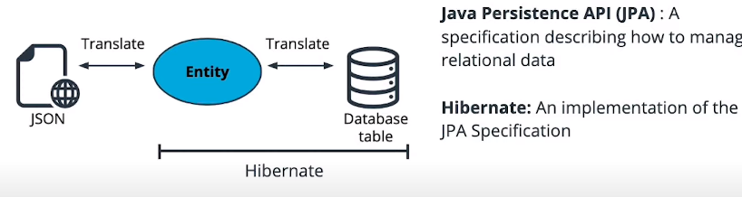

## Values vs. Entity Types
### POJO or "Plain Old Java Object"
A Java object that contains data, but **no methods to describe behavior**.

### Entity Types
Entity Types are Java classes that describe a collection of data. They are similar to POJOS
-   Contain Data only, no behavior
-   **Represented by a table in the database**

### Value Types
The data inside an Entity.
-   Primitives like int, boolean, char
-   Classes that only represent a single piece of data, like BigInteger or LocalDate
-   Represented by a column in the database

### @Entity and @Table Annotations
- `@Entity` **informs Hibernate** that this **class** should be **stored in the database**. Each Entity class will be associated with a table of the same name, or a different name table can be created by using the `@Table` annotation at the class level.
- The attributes of the classes automatically become columns of the same name, and it's name can be changed and properties defined by using the `@Column` annotation.
- Entity classes must provide a public or protected no-arg constructor.

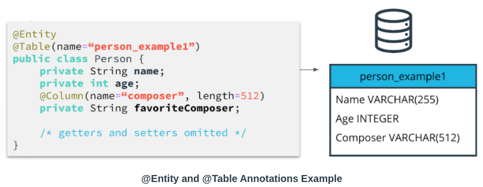

For additional details on mapping types, see the [official Hibernate documentation on mapping types](https://docs.jboss.org/hibernate/orm/5.4/userguide/html_single/Hibernate_User_Guide.html#mapping-types).

## Basic Types
Basic Types map a single database column to a single, non-aggregated Java type. Here are some examples of basic types:
- java.lang.String (Java) ->  VARCHAR (JDBC) -> StringType (Hibernate) -> string (Registry Key)
- java.lang.String (Java) ->  NVARCHAR (JDBC) -> StringNVarcharType (Hibernate) -> nstring (Registry Key)
- int, java.lang.Integer (Java) ->  INTEGER (JDBC) -> IntegerTypes (Hibernate) -> int (Registry Key)
- [Full List of Hibernate standard BasicTypes](https://docs.jboss.org/hibernate/orm/5.4/userguide/html_single/Hibernate_User_Guide.html#basic).

Hibernate selects default BasicTypes automatically, but it can be overrided by specifying the @Type annotation, as below
```java
@Entity
@Table(name="person_example)
public class Person {
	@Type(type="nstring")
	private String name;
	private int age;
}
```

Each BasicType should only map a single value to a single column in the database. Do not attempt to serialize objects or lists of primitives into a single column. Doing so violates **First Normal Form of database design**, preventing standard relational functioning.
- First Normal form: Each attribute of a table contains only  **atomic**  values.
- Atomic: Representing a single piece of data; indivisible

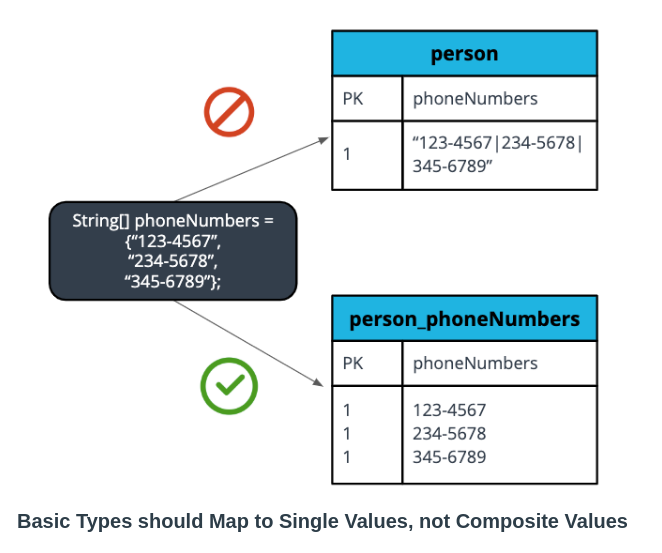

## Identifiers
All Entities must define an identifier that uniquely identifies them. We express this by using the `@Id` annotation.
```java
@Entity
public class Person {
    @Id
    @GeneratedValue
    Long id;
   /* rest of class */
}

```

**Valid identifier types are**:
-   Any Java primitive type
-   Any primitive wrapper type (like  `Long`, or  `Boolean`)
-   A  `String`
-   `java.sql.Date`  or  `java.util.Date`
-   `java.math.BigDecimal`  or  `java.math.BigInteger`

The  `@GeneratedValue`  annotation causes this value to be **assigned automatically**.
```java
@Entity
public class Post {
	@Id
	@GeneratedValue(
	    strategy = GenerationType.SEQUENCE,
	    generator = "seq_post"
	)
	@SequenceGenerator(
	    name = "seq_post",
	    allocationSize = 5
	)
	private Long id;

}
```
```
CREATE SEQUENCE seq_post START 1 INCREMENT 5
 
CREATE TABLE post (
    id INT8 NOT NULL,
    title VARCHAR(255),
    PRIMARY KEY (id)
)
```
The  `generator`  attribute of the  `@GeneratedValue`  annotation references the  `name`  attribute of the  `@SequenceGenerator`  annotation.

The  `name`  attribute of the  `@SequenceGenerator`  is also used to **reference the database sequence** object that’s called to get the new entity identifiers.

## Composite Identifiers

## Composite Key with `@Embeddable` and `@EmbeddedId` 
Composite identifiers **combine multiple attributes to define uniqueness**. One way to implement this is by creating an `@Embeddable` class and using `@EmbeddedId` to identify it in your Entity.
```java
@Embeddable
public class PersonPK implements Serializable {
   private int cpf;
   private String fullName;

   @Override
   public boolean equals(Object o) {
       if (this == o) return true;
       if (o == null || getClass() != o.getClass()) return false;
       PersonPK personPK = (PersonPK) o;
       return cpf == personPK.cpf &&
               fullName.equals(personPK.fullName);
   }

   @Override
   public int hashCode() {
       return Objects.hash(cpf, fullName);
   }

  /*  getters and setters */
}
```

```java
@Entity
public class Person {
   @EmbeddedId
   PersonPK id;
  /* rest of class */
}
```

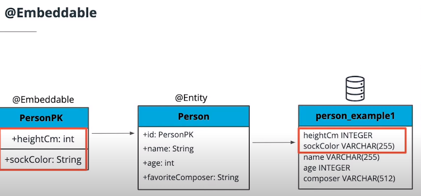

## Composite Key with `@IdClass`
The `@IdClass` annotation allows to specify a composite primary key by shadowing the fields of your key class in the Entity. This can be useful if you must use an object as a primary key that cannot be `@Embeddable`.

```java
public class PersonPK implements Serializable {
   private int cpf;
   private String fullName;

   @Override
   public boolean equals(Object o) {...}

   @Override
   public int hashCode() {...}
   /* getters and setters*/
}
```

```java
@Entity
@IdClass(PersonPK.class)
public class Person {
   @Id
   private int cpf;
   @Id
   private String fullName;

   public PersonPK getId() {
       PersonPK id = new PersonPK();
       id.setCpf(cpf);
       id.setFullName(fullName);
       return id;
   }

   public void setId(PersonPK id) {
       this.cpf = id.getCpf();
       this.fullName = id.getFullName();
   }
   /* getters and setters */
}
```


> Where do `@Embeddable` and `@IdClass` Composite Keys get stored?
> Answer: Fields for both types of composite key are stored in the same table as the rest of the Entity.

### Additional Resources
-   [Hibernate documentation on Composite Keys](https://docs.jboss.org/hibernate/orm/5.4/userguide/html_single/Hibernate_User_Guide.html#identifiers-composite)

## Relationships
### Ways to Associate Data
-   **Value Types**: Become single columns in containing Entity’s table.
-   **Embeddables**: **Add their attributes as columns** in the containing Entity’s table.
-   **Entities**: Become new tables which relate to a containing entity by a  **Join Column**.

### Types of Entity Associations
-   **OneToOne**: Single Entity on each side of the relationship.
-   **OneToMany**  and  **ManyToOne**: List of Entities on one side, single Entity on the other.
-   **ManyToMany**: Lists of Entities on both sides.

#### OneToOne
**Unidirectional**  - *Association specified on one side of the relationship* only.
-   Doesn't retrieve data you won’t use.
-   Should use Set collection type for most efficient SQL.

```java
@Entity
public class Person {
   @Id
   @GeneratedValue
   private Long id;

   @OneToMany
   private List<Outfit> outfits;

   /* rest of class */
}

@Entity
public class Outfit {
   @Id
   @GeneratedValue
   private Long id;

   /* rest of class */
}
```

#### OneToMany and ManyToOne
**Bidirectional**  - *Association specified on both sides* of the relationship. 
- Access both sides of relationship with a single query.
- Use  `mappedBy`  on the **containing Entity side**.
- Hibernate recommends for  `@OneToMany`, because it allows the foreign key constraint to exist only on the table of the contained object.

**Example:** Bellow there is a  bidirectional **OneToMany** relationship showing that one person has many outfits, and each outfit has one person.

```java
@Entity
public class Person {
   @Id
   @GeneratedValue
   private Long id;

   @OneToMany(mappedBy = "person")
   private List<Outfit> outfits;

   /* rest of class */
}

@Entity
public class Outfit {
   @Id
   @GeneratedValue
   private Long id;

   @ManyToOne
   private Person person;

   /* rest of class */
}
```

#### ManyToMany and `@JoinColumn`
```java
@Entity
public class Person {
   @Id
   @GeneratedValue
   private Long id;

   @ManyToMany
   @JoinTable(
      name = "person_outfit",
      joinColumns = { @JoinColumn(name = "person_id")},
      inverseJoinColumns = { @JoinColumn(name = "outfit_id")}
   )
   private List<Outfit> outfits;

   /* rest of class */
}
```

### `@ElementCollection` - Association Between a Single Entity and Non-Entity values
Use the `@ElementCollection` annotation to denote an association between a single Entity and a list of values that are not themselves Entities. All the records of the collection are stored in a separate table. The configuration for this table is specified using the `@CollectionTable` annotation.

This annotation allows the persistance of Embeddables or enums, for example. **These embeddables will be stored in a separate table, along with the id of the Entity** in which they are contained.

**Example 1**
```java
@Entity
public class Person {
   @Id
   @GeneratedValue
   private Long id;

   @ElementCollection
   private List<Outfit> outfits;

   /* rest of class */
}

@Embeddable
public class Outfit {
   private String hat;
   private String gloves;
   private String shoes;
   private String legs;
   private String top;
}
```

**Example 2**
```java
@Entity
@Table(name="student")
public class Student {
   @Id
   @GeneratedValue
   private Int id;
   
   @ElementCollection
   @CollectionTable(name="image", joinColumns=@JoinColumn(name="student_id))
   @Column(name="file_name")
   private List<String> images;

	/* rest of class */
   
}
```

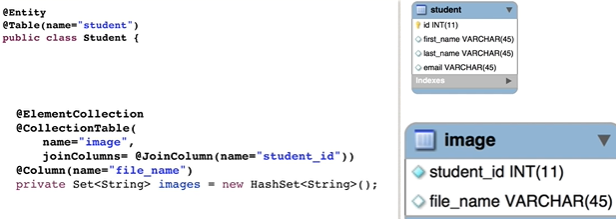

### Good Practice 101
- TODO Get Example from this [Site](https://ankitkamboj18.medium.com/a-guide-to-jpa-with-hibernate-relationship-mappings-onetoone-onetomany-manytoone-310ce31df3f6)
**Note:** It's a good practice to put the owning side of a relationship in the class/table where the foreign key will be held.

### Two-Way Relationship (Bidirectionality) vs. TWO One-Way relationships
https://stackabuse.com/a-guide-to-jpa-with-hibernate-relationship-mapping/
https://thorben-janssen.com/ultimate-guide-association-mappings-jpa-hibernate/

## Inheritance
Inheritance is a way to share data and associations across multiple related classes. 

### Single Table Inheritance
The **default inheritance strategy** used by Hibernate is **Single Table inheritance**. 

- maps all entities of the inheritance structure to the **same database table**.
- **All the fields of the parent and children classes are stored in the same table.**
- **Allows the fastest polymorphic queries** because no tables need to be joined to access all subclasses
- Cannot support Not Null column constraints because columns must be able to contain null for sibling classes.
-  An entity discriminator is created automatically and is stored in a column which is not an entity attribute. Its possible to define de column name with a **@Discriminator**

This is an example of sharing the association from `Person` to `Outfit` with another class by creating a `Humanoid` parent class.

```java
@Entity
public abstract class Humanoid {
   @Id
   @GeneratedValue
   Long id;

   @OneToMany(mappedBy = "humanoid")
   List<Outfit> outfits;

   /* getters and setters */
}

@Entity
public class Person extends Humanoid {

   @Type(type="nstring")
   private String name;
   private int age;
   @Column(name="composer", length=512)
   private String favoriteComposer;

   /* getters and setters */
}

@Entity
public class Mannequin extends Humanoid {

   private boolean hasAHead;
   private MannequinShape mannequinShape;

   enum MannequinShape {
       LITHE, MUSCULUR, UNASSUMING;
   }

    /* getters and setters */
}
```
 
 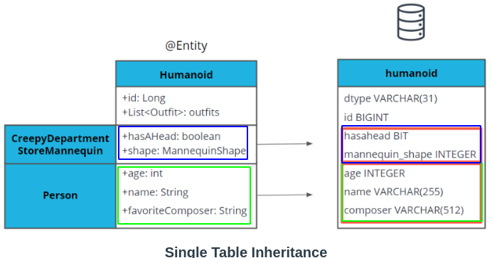

### Joined Inheritance
Creates a **table for the parent class and each subclass**. **The subclass tables only have fields unique to their class.** 

**Supports polymorphic** queries by UNIONing subclass tables. Uses the least space of the solutions that allow Not Null columns.

```java
@Entity
@Inheritance(strategy = InheritanceType.JOINED)
public class Humanoid {
   @Id
   @GeneratedValue
   Long id;

   @OneToMany(mappedBy = "humanoid")
   List<Outfit> outfits;

   /* getters and setters */
}
```
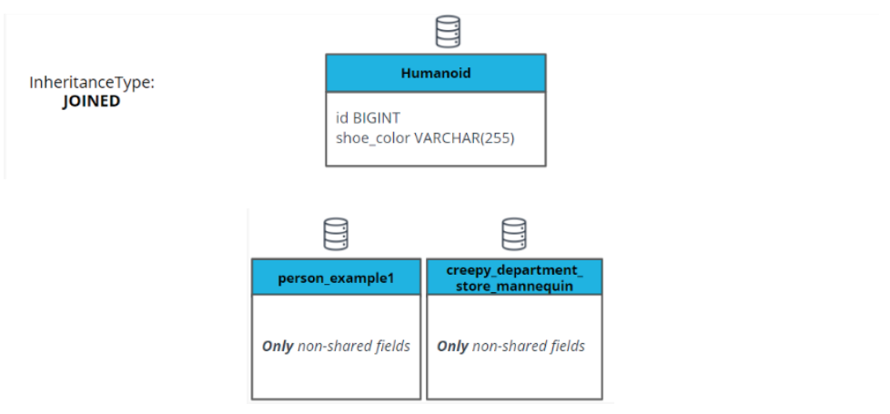

### Table Per Class Inheritance
Creates a table for the parent class and each subclass. **The subclass tables have all fields from the parent class as well as fields unique to their class.** Supports polymorphic queries by UNIONing subclass tables, but does not require any UNION to access superclass fields on non-polymorphic queries.

- It’s preferable to Mapped Superclass for most cases, because it leaves you the option of making polymorphic queries if you need to in the future.

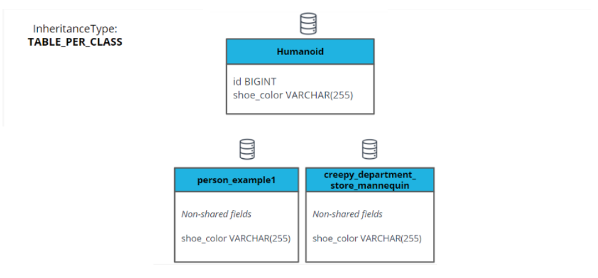

### Joined Inheritance vs. Table Per Class Inheritance
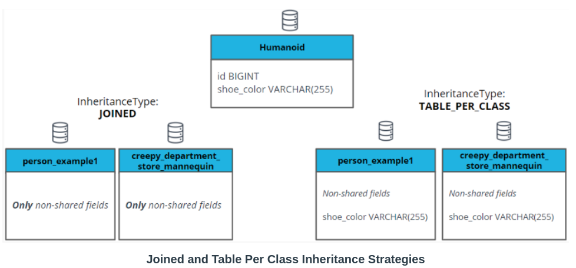
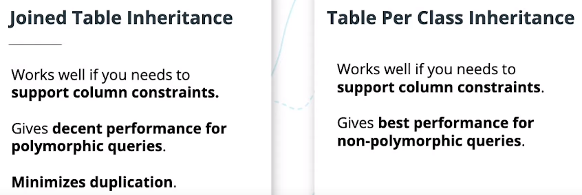

### Mapped SuperClass Inheritance
This is selected by using the `@MappedSuperclass` annotation on the parent class instead of `@Entity`. It creates a table per class just like TABLE_PER_CLASS, **but there is no superclass table**(the parent has no table in the database). It does not support polymorphic queries, but never requires UNIONS to query subclasses.

**When to use this strategy?** Use the Mapped SuperClass strategy in scenarios where you want to share fields from a parent class, but never intend to query for all instances of the parent class as a group 

### Inheritance Mapping Strategies
**Single Table**: Store all subclasses in one table. Requires nullable columns for subclass fields

**Joined Table:** One table per entity, including parent. Parent fields not duplicated in subclass tables.

**Table Per Class:** One table per entity, with parent fields duplicated in subclass tables.

**Mapped Superclass**: One table per subclass, no parent class table. Does not support polymorphic queries

### Additional Resources
-   [Hibernate documentation on Inheritance](https://docs.jboss.org/hibernate/orm/5.4/userguide/html_single/Hibernate_User_Guide.html#entity-inheritance)
- [Inheritance Strategies with JPA and Hibernate](https://thorben-janssen.com/complete-guide-inheritance-strategies-jpa-hibernate/)

### Inheritance and Relationship - Example
See Example [Here](./Hibernate-Relationships-and-Inheritance-Example.md)

## Data Transfer Objects - DTOs
Data structures designed to represent the needs of the front end.

### DTO Summary
-   Simplify and document interaction between front end and Controller.
- The DTO objets shoud not be referenced outside the controller classes. They only define data format specific to the endpoints provided by the controller.
- Any exchanges with the service layer will envolving transforming the data between the entity and the DTO
	- **Recommendation: Translation between DTO and entity happens inside the controller layer**
-   Conceal database structures.
-   Limit the amount of data exchanged.
-   Customize display data to meet the needs of the front end.

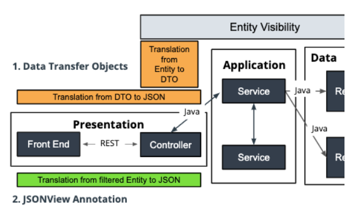

### Example of DTO to Entity Conversion - Using `BeanUtils`
```java
private static Outfit convertOutfitDTOToEntity(OutfitDTO outfitDTO){
	Outfit outfit = new Outfit();
	BeansUtils.copyProperties(outfitDTO,outfit);
	return outfit;
}
```

### JSONView Annotations
Annotation that filters which Entity data is visible to the Presentation layer.

### `@JSONView`  Summary
-   Quickly specify which parts of Entities should be visible to which consumer.
-   Often a simple choice when controlling full stack.
-   Not as helpful when you need to combine data from multiple Entities.
-   Can require Entity updates if front end needs change.
-   Often grouped together in a Views class, containing interfaces such as ‘Public’, ‘Private’, or interfaces named for specific endpoint recipients.

### Example
Create a REST endpoint that allows users to retrieve the price for a plant with a specific name, but without show them ids or any information about the Delivery that plant is scheduled for.

```java
@RestController
@RequestMapping("/plant")
public class PlantController {

   @Autowired
   private PlantService plantService;

   @JsonView(Views.Public.class)
   public Plant getFilteredPlant(String name){
       return plantService.getPlantByName(name);
   }

   private PlantDTO convertPlantToPlantDTO(Plant plant){
       PlantDTO plantDTO = new PlantDTO();
       BeanUtils.copyProperties(plant, plantDTO);
       return plantDTO;
   }
}
```

```java
public class Views {
    public interface Public {}
}
```

```java
@Entity
@Inheritance(strategy = InheritanceType.JOINED)
public class Plant {
   @Id
   @GeneratedValue
   private Long id;

   @JsonView(Views.Public.class)
   @Nationalized // should use @Nationalized instead of @Type=nstring
   private String name;

   @JsonView(Views.Public.class)
   @Column(precision=12, scale=4)
   private BigDecimal price; // BigDecimal is the standard Java class for currency math

   @ManyToOne //many plants can belong to one delivery
   @JoinColumn(name = "delivery_id")  //map the join column in the plant table
   private Delivery delivery;

   /* getters and setters*/
}
```