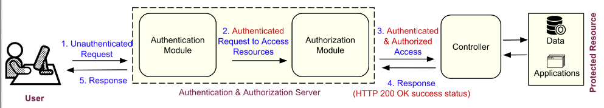

# Authentication and Authorization

## What is Authentication ?
Authentication confirms your identity. It is a process that proves that you are the person who you say you are. In the digital world, the most common way to authenticate is to use a username and password. For example, while logging into your eCommerce account, you prove your identity by providing an email and a password, sometimes followed by an OTP or a second factor. There are many other ways to authenticate, and these are depicted in the figure below.

### Common Mechanisms for Authentication
-   **Token-based authentication**  - It is a temporary credential that you (client) have which proves your identity. Read more  [here](https://scotch.io/tutorials/the-ins-and-outs-of-token-based-authentication). Note: we do use this later in the form of JWT, but we first authenticate with the username and password, then send the token on each subsequent request.

-   **OAuth**  - is an industry-standard protocol for authorization that provides a token on your behalf once you’ve authenticated to the external service. Read more  [here](https://auth0.com/docs/protocols/oauth2). For example, if you've ever seen a "Sign in with Google/Facebook/etc", this is likely done using OAuth.

-   **Time-based token**  (TOTP) - a token is generated with something only you know. This token changes after some time period. Read more  [here](https://www.freecodecamp.org/news/how-time-based-one-time-passwords-work-and-why-you-should-use-them-in-your-app-fdd2b9ed43c3/). This is very commonly used in Two Factor Authentication as the 2nd factor. If you have random codes you need to enter, they may have been generated using this scheme.

-   **Biometric authentication**  such as Fingerprint or Facial recognition (popular on smartphones). Most of the standard mechanisms for authentication utilizes either of the following two "Network authentication protocols": i). Kerberos, and ii). Secure Sockets Layer (SSL) / Transport Layer Security (TLS).

### More to Explore - Network Authentication Protocols
Kerberos provides secure authentication for client/server applications by using secret-key cryptography. Here are some links on Kerberos  [here](https://www.kerberos.org/docs/index.html). On the other hand, SSL/TLS uses a cryptographic system that uses two keys to encrypt data − a public key known to everyone and a private or secret key known only to the recipient of the message. A typical example is an HTTPS website that utilizes SSL/TLS certificate that is signed by a publicly trusted Certifying Authority. Here is a resource for SSL/TLS  [here](https://en.wikipedia.org/wiki/Transport_Layer_Security).

### Authentication Considerations
Good authentication practices center around protecting the data used for authentication, such as:

You wouldn't just tell people your password, and so your website shouldn't either.
You also need to ensure that passwords are sufficiently random and complex, with things like length requirements, to ensure that your credentials aren't easily cracked.
They must not be able to be forged easily, so no one can impersonate anyone else. Finally, they have to be deterministically generated, that is they must be generated the same way every time, to ensure you actually can authenticate users into your system.

## What is Authorization ?
> The authorization concerns itself with permission and rights.

In general,  **Authorization**  comes after Authentication. Authorization determines whether you are permitted or have the right privilege to access the requested resources. In other words, it determines what a user is allowed to access.

### Role-Based Access Control (RBAC)
In RBAC, access is given based on a user's role—as a manager, engineer, customer service representative, etc.

Permissions can then be given (and limited) to users based on their roles. That way, each type of user only has  _limited access_—they are able to access only the specific things they need for their particular job.

## Basic Authentication and Authorization Steps
