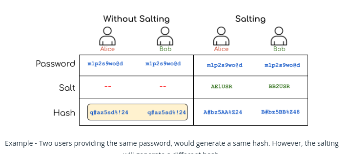

# Salting
A salt is random data that is used as an additional input to the hash function so that the final hash becomes more secure.

> **Salting is an approach to generate two different hash values for two different users providing the same input.**

## Points to Consider
1.  In a web application, the Salting must be done on the Server.    
2.  While hashing user-passwords, the  **Salt**  should be generated randomly. It is preferable if the Salt is unique for each user's password.    
3.  For numeric Salt, it is good to use secure algorithms such as Cryptographically Secure Pseudo-Random Number Generator (CSPRNG). Java has  `java.security.SecureRandom`  class for generating PRNG.    
4.  For pseudo-random  **alpha-numeric**  string generator, you may use Apache class, as  `org.apache.commons.text.RandomStringGenerator`
5.  When we use Salting, there are two separate steps involved:    
    -   Generate the salted password, and
    -   Verify the salted password.