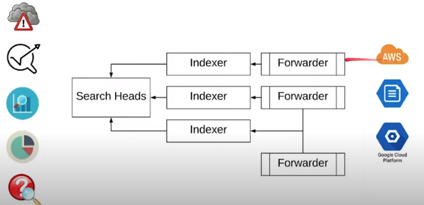
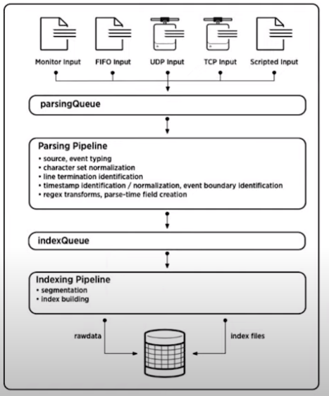

## What is Splunk?

[Splunk](https://www.splunk.com/en_us/download.html)  is a search engine for IT data that was created to analyze machine-generated data.

### Machine-generated data
Machine-generated data refers to the data generated by application logs, server logs, network devices, sensors, IoT, cloud services, or mobile services. The data could be structured or unstructured.
-   Structured data has clearly defined data-types and a particular pattern e.g., relational data. It resides in a database, on which we can run queries.
-   Unstructured data has no specific pattern e.g., textual log messages, reviews on the eCommerce platform.

### Challenges without Splunk
Machine-generated data is challenging to analyze because:
-   Its volume is high
-   Sometimes it is unstructured, thus requires a pre-processing

### Benefits
Splunk helps generate information from machine-generated data and provides insights quickly. It helps to scale the data input limitlessly. It also provides machine learning capabilities to build auto-alert systems. Splunk helps the user to leverage machine-generated data in gauging the system performance, investigating the failure conditions, developing the business matrix, data visualization, and many more benefits.

## Indexing in Splunk
### Why do we need indexing?
The  **"index"**  helps to reduce the search and analysis time for an operation. When the Splunk indexes raw data, it transforms the data into searchable events (flat files and metadata). Indexes reside in flat files called "tsidx files". These "tsidx files" (indexes) point to the raw data.

**Indexer**  perform the indexing of incoming raw data. The indexer is an instance of Splunk Enterprise. Splunk creates multiple indexers by replicating the data so that the system keeps multiple copies of all data.

### How does indexing work in Splunk?
Indexes are the searchable events. Events are records of activity that reside in log files and metadata. During indexing, Splunk Enterprise performs event processing. Splunk does the following tasks - the configuration of the character set encoding, stores timestamps, extraction of the standard fields, segmentation of events, and adding metadata.

### Type of Indexes
There are two types of indexes:
-   Events indexes - Events indexes impose minimal structure and can accommodate any type of data, including metrics data. Events indexes are the default index type.
-   Metrics indexes - Metrics indexes use a highly structured format to handle the higher volume and lower latency demands associated with metrics data.

## Splunk Components
Components are the different types of  [Splunk Enterprise instances](https://docs.splunk.com/Splexicon:Instance). Each instance (component) has its own specific role. Broadly, there are two categories -  **"Processing"**  and  **"Managing"**  components.

-   The "forwarders", "indexers" and "search heads" are the Processing-components.
-   The "deployment server", "monitoring console" are a few examples of Managing-components.

At this point, it is essential to introduce the concept of  **"pipeline"**  in Splunk. Raw data enters the pipeline, and it gets processed by the Processing-components. The pipeline is segmented into smaller parts, and each part is mapped with one or more Processing-components. Segments of the pipeline are - data input, parsing, indexing, and searching. The following is the mapping between pipeline segments and processing components:

| Data pipeline segment | Components                                    |
|-----------------------|-----------------------------------------------|
| Data input            | indexer, universal forwarder, heavy forwarder |
| Parsing               | indexer, heavy forwarder                      |
| Indexing              | indexer                                       |
| Search                | indexer, search head                          |

- Forwarder (Universal, Heavy forwarder) -  gets raw data.
- Indexer - Receives the raw data from the fowarder and indexes the data.
	- Converts the forwarder's raw data into events and indexes it into a bucket
- Search Heads - Pulls the data indexed by the indexer when some kind of querying is made.

### Deployment Topology
There could be different deployment topology based on the requirements of the project. The following are the examples:

-   Single host - independent search heads manage searches for a group of independent indexers.
-   High Availability - a group of indexers replicate data among themselves to ensure high data availability.
-   Multiple data store clustering - a group of search heads share search management responsibilities.
-   Multiple datastore peering - common in larger deployments. It is similar to the pattern of high availability, except that the search management function is handled by a search head cluster instead of individual search heads.

Splunk deployment guide  [here](https://www.splunk.com/themes/splunk_com/img/assets/pdfs/education/SplunkDeploymentGuide2_1.pdf).
